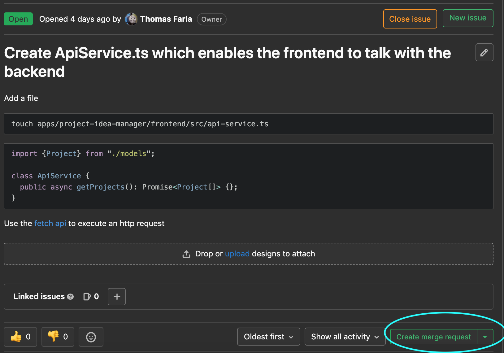
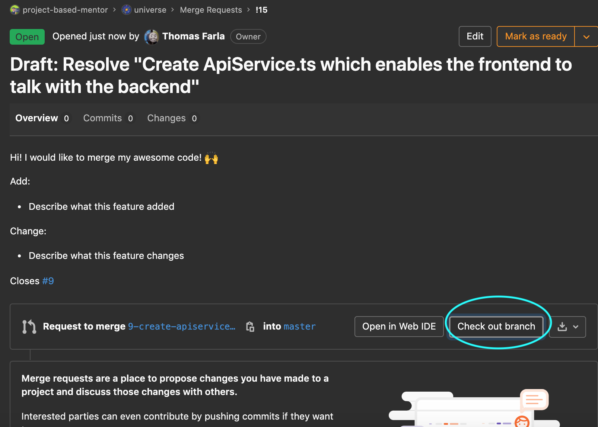
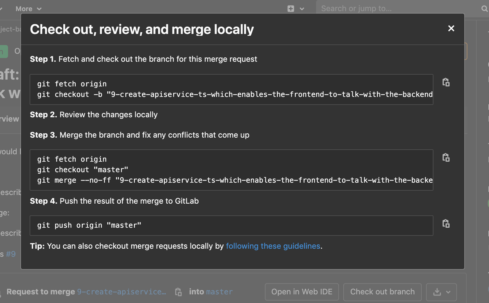
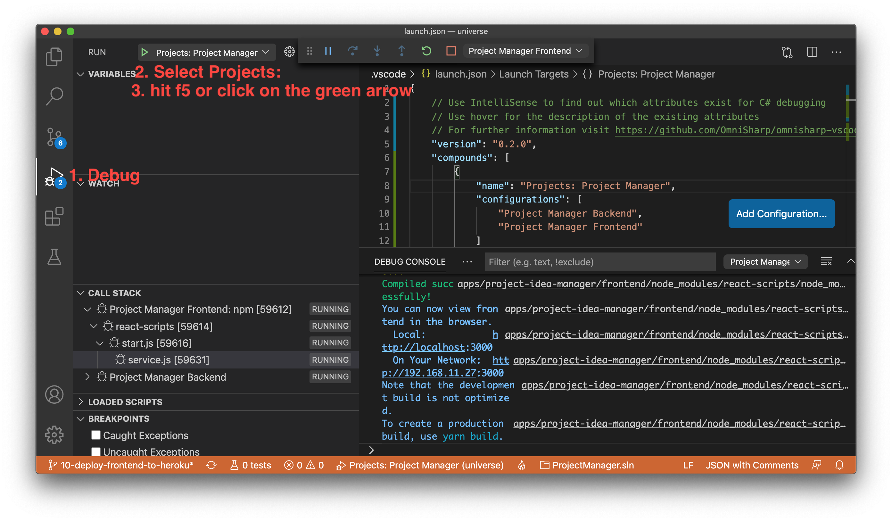

# universe

Mono repository containing all projects build within the project based mentor program

- [universe](#universe)
- [Getting started](#getting-started)
  - [Kanban board](#kanban-board)
  - [Create a Merge request](#create-a-merge-request)
  - [Project structure](#project-structure)
- [Communication](#communication)
- [Apps](#apps)
  - [Starting apps](#starting-apps)
  - [Project Idea Manager](#project-idea-manager)
- [Visual studio code](#visual-studio-code)
- [Contribute](#contribute)
- [Attributions](#attributions)

# Getting started

Install the [visual studio code editing software](https://code.visualstudio.com/) and [git](https://git-scm.com/downloads).

## Kanban board
In order to keep track of progress, report bugs and think about new features we use a project management method called [kanban](https://www.atlassian.com/agile/kanban). Take a look at our [kanban board](https://gitlab.com/project-based-mentor/universe/-/boards) and maybe you'll find something interesting.

## Create a Merge request
> A Merge Request (MR) is a request to merge one branch into another.
> Use merge requests to visualize and collaborate on proposed changes to source code.
> https://docs.gitlab.com/ee/user/project/merge_requests/

All code in this repository should be reviewed & approved before it's deployed to the `master` branch by one of the maintainers of this project. Follow these steps to create a merge request and a branch associated with it.


1. navigate to the issue and click on `Create merge request`


2. A branch is automatically created. To checkout this branch click on the `Check out branch button` on the merge request


3. This will open a new window with commands that you should execute in the terminal inside the cloned repository


## Project structure

```
.
# All application code
├── apps
# documentation for the Project based mentorship program
└── documentation
# Public website source
    └── public-website
```

# Communication
We use the slack app as our messaging application.

# Apps

## Starting apps
Make sure to follow the readme and installation instructions in the README.md of the app. Then there should be a vscode configuration to run both the backend and the frontend.



## Project Idea Manager
Manage and select project ideas to do within this repository.

https://pbm-pm-frontend.herokuapp.com/

**skills**

<table>
    <tbody>
        <tr>
            <th rowspan="5">Frontend</th>
            <td>
                <a href="https://reactjs.org/docs/getting-started.html)">React</a>
            </td>
            <td>Used as frontend library</td>
        </tr>
        <tr>
            <td>
                <a href="https://developer.mozilla.org/en-US/docs/Learn/HTML/Introduction_to_HTML/Getting_started">HTML5</a>
            </td>
            <td>
                Used for mark up
            </td>
        </tr>
        <tr>
            <td>
                <a href="https://developer.mozilla.org/en-US/docs/Learn/CSS/First_steps/Getting_started">CSS3</a>
            <td>
                Used for styles
            </td>
        </tr>
        <tr>
            <td>
                <a href="https://storybook.js.org/">Storybook</a>
            </td>
            <td>Used for component driven development</td>
        </tr>
        <tr>
            <td>
                <a href="https://www.typescriptlang.org/docs/handbook/typescript-in-5-minutes.html">Typescript</a>
            </td>
            <td>Static typed programming language</td>
        </tr>
        <tr>
            <th rowspan="2">Backend</th>
            <td>
                <a href="https://docs.microsoft.com/en-us/dotnet/csharp/getting-started/">C#</a>
            </td>
            <td>Backend programming language</td>
        </tr>
        <tr>
            <td>
                <a href="https://docs.microsoft.com/en-us/dotnet/core/get-started">Dotnet core</a>
            </td>
            <td>Backend framework</td>
        </tr>
    </tbody>
</table>

Read more in the project's [readme](apps/project-idea-manager)

# Visual studio code

Install the folowing extensions:

- https://marketplace.visualstudio.com/items?itemName=EditorConfig.EditorConfig
- https://marketplace.visualstudio.com/items?itemName=jchannon.csharpextensions
- https://marketplace.visualstudio.com/items?itemName=kishoreithadi.dotnet-core-essentials
- https://marketplace.visualstudio.com/items?itemName=josefpihrt-vscode.roslynator
- https://marketplace.visualstudio.com/items?itemName=Fudge.auto-using

**Additional tools**

- [live share](https://marketplace.visualstudio.com/items?itemName=MS-vsliveshare.vsliveshare-pack)
- [git lens](https://marketplace.visualstudio.com/items?itemName=eamodio.gitlens)

# Contribute

Please read the [contribution guidelines](CONTRIBUTING.md) before submitting code

# Attributions

The project icon has been made by [freepik](https://www.flaticon.com/authors/freepik) from [flaticon](https://www.flaticon.com/)

The organization icon has been made by Icons made by <a href="https://www.flaticon.com/authors/freepik" title="Freepik">Freepik</a> from <a href="https://www.flaticon.com/" title="Flaticon"> www.flaticon.com</a>
